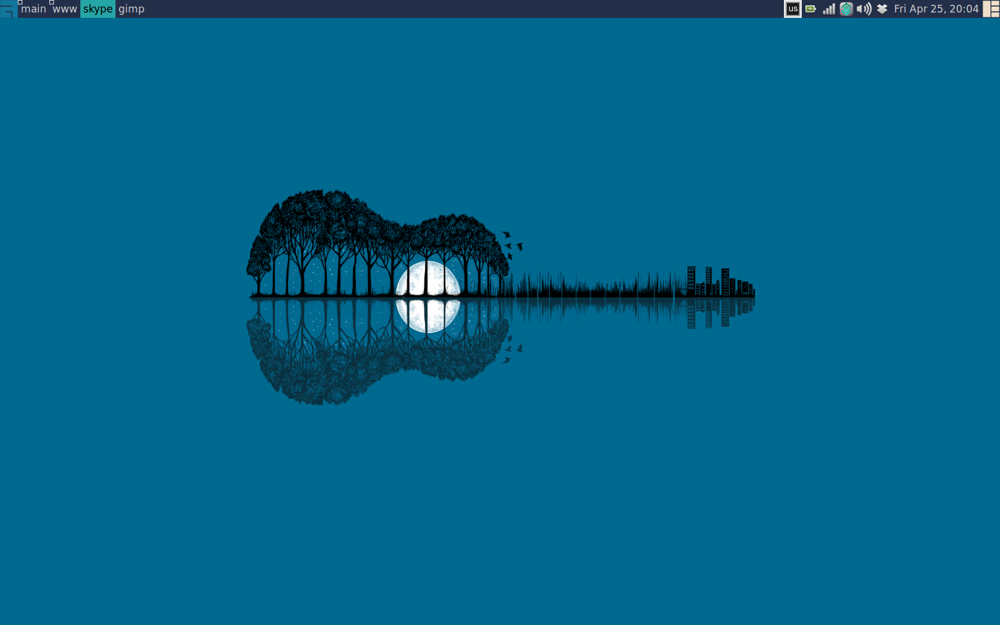

wave
====

### Install
Install this awesome theme as normal. Place the wave directory
in your themes directory, such as ~/.config/awesome/themes, and update your
rc.lua file::

    beautiful.init("path/to/themes/wave/theme.lua")

### About
This awesome window manager theme is based off of waf's nice-and-clean-theme theme.
